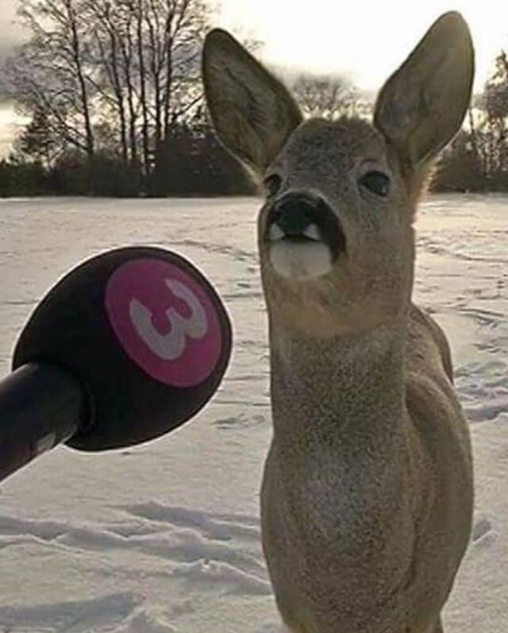
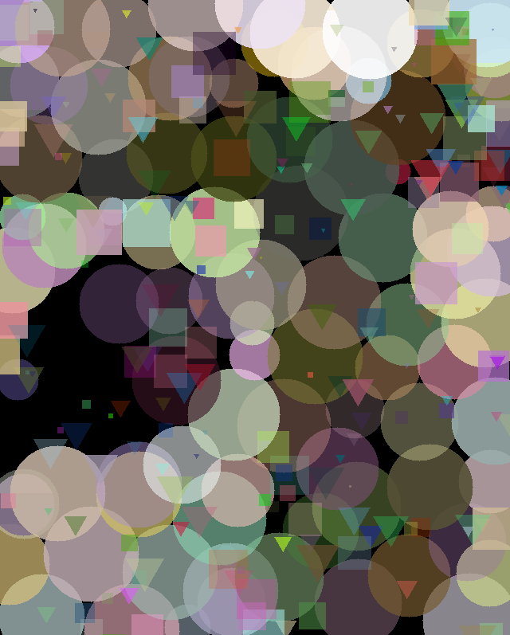

# AlgoPainter

AlgoPainter is a high-performance, CUDA-accelerated evolutionary art generator. It uses a **Genetic Algorithm (GA)** to approximate a target image using a set of semi-transparent geometric shapes (Circles, Squares, and Triangles).

##  Key Features

- **CUDA-Powered Rasterization:** A custom per-pixel rendering engine that handles complex alpha blending and thousands of shapes in parallel.
- **4x Super-Sampled Anti-Aliasing (SSAA):** High-quality visual output with smooth edges achieved through 2x2 supersampling directly in the GPU kernel.
- **Progressive Resolution:** The algorithm starts by optimizing a low-resolution version of the image to find the general composition rapidly, then progressively increases resolution for fine detail.
- **Advanced Evolution:**
  - **Alpha Mutation:** Shapes evolve their own transparency.
  - **Layer Mutation:** The algorithm can swap the "draw order" of shapes to better layer elements.
  - **Tournament Selection & Elitism:** Ensures the best traits are preserved and passed on efficiently.

##  How It Works

### 1. The Genetic Algorithm
Every "painting" is an **Individual** consisting of a fixed number of **Genes** (shapes). 
- **Mutation:** Randomly modifies a shape's position, size, color, alpha, or type. It also includes "Swap Mutations" to change the layering order.
- **Crossover:** Combines parts of two successful paintings to create new offspring.
- **Fitness:** Calculated on the GPU by computing the Mean Squared Error (MSE) between the generated painting and the target image.

### 2. GPU Rendering Pipeline
Unlike standard rasterizers that draw shapes one by one (prone to race conditions in parallel), AlgoPainter uses a **Per-Pixel Kernel**:
1. For every pixel, the GPU looks at all shapes in the individual.
2. It performs a **Bounding Box check** to cull irrelevant shapes.
3. It performs **4-sample supersampling** for anti-aliasing.
4. It computes the final color by blending shapes in their specific genetic order.

## Requirements

- **C++17** Compiler
- **CUDA Toolkit 11.0+**
- **SFML 3.0** (Graphics, Window, System)
- **CMake 3.18+**
- NVIDIA GPU (Compute Capability 8.9+ recommended)

##  Building

1. Ensure your `SFML_DIR` is correctly set in `CMakeLists.txt`.
2. Place your target image in `assets/target.jpg`.
3. Build using CMake:
   ```bash
   mkdir build
   cd build
   cmake ..
   make # or use Visual Studio
   ```

##  Example Output

|          Target Image          |                         Generated Artwork                         |                               VIDEO                               | 
|:------------------------------:|:-----------------------------------------------------------------:|:-----------------------------------------------------------------:|
|  |  |  |

> *Generated after ~5500 generations with a population size of 250, 200 genes, 0.05 mutation rate and tournament size of 4*

## Controls

- `S`: Save the current best individual as a PNG in the `output/` directory.
